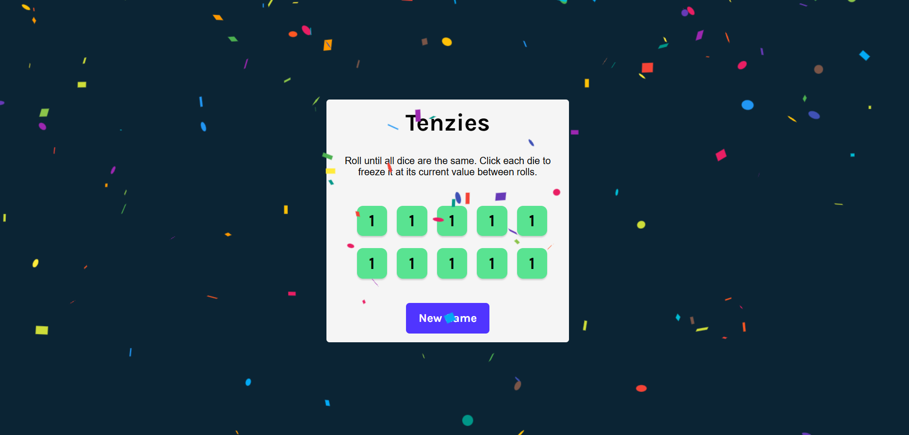

# Tenzies Game

Tenzies is a dice game built with React where the goal is to roll until all dice show the same value.  
Players can hold selected dice between rolls to reach the objective faster.

## Preview

## Technologies
- React
- JavaScript
- Vite
- CSS

## Live Demo
https://tenzies-plum.vercel.app/

## Features
- Hold dice functionality
- Random dice rolling
- Win detection logic
- Responsive layout

## How to run locally
npm install
npm run dev
